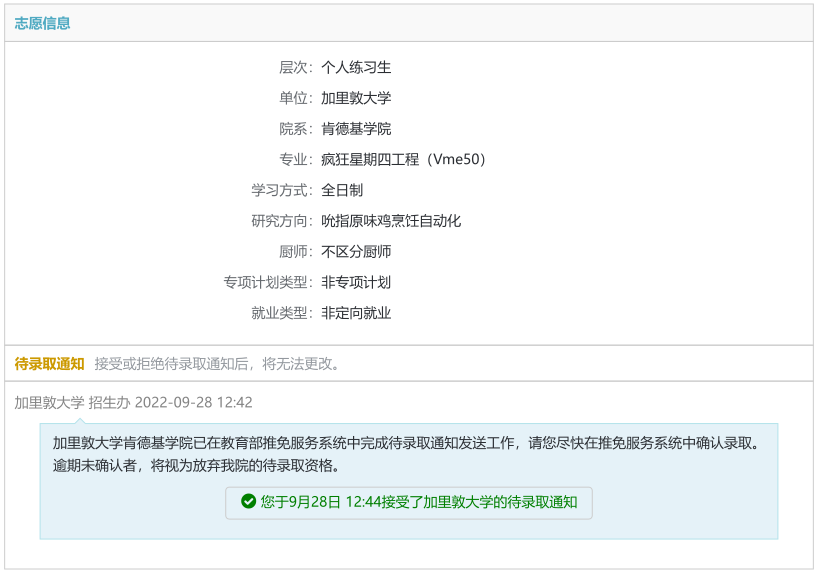
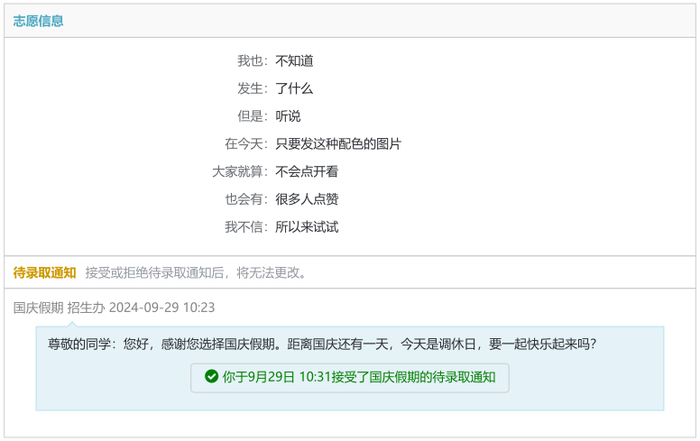

# Pigeonful

A typst package for creating splendid document similar to [研招网推免](https://yz.chsi.com.cn/tm/student/dlqtz/list.action) style.

## Examples

### KFC



```typst
#import "../src/lib.typ": pigeonful

#set page(width: auto, height: auto, margin: 4pt)

#pigeonful(
  entries: (
    "层次": [个人练习生],
    "单位": [加里敦大学],
    "院系": [肯德基学院],
    "专业": [疯狂星期四工程（Vme50）],
    "学习方式": [全日制],
    "研究方向": [吮指原味鸡烹饪自动化],
    "厨师": [不区分厨师],
    "专项计划类型": [非专项计划],
    "就业类型": [非定向就业],
  ),
  notifier: [加里敦大学 招生办 2022-09-28 12:42],
  notice-body: [加里敦大学肯德基学院已在教育部推免服务系统中完成待录取通知发送工作，请您尽快在推免服务系统中确认录取。逾期未确认者，将视为放弃我院的待录取资格。],
  acceptance: [您于9月28日 12:44接受了加里敦大学的待录取通知],
  width: 810pt,
)
```

### National Holiday



```typst
#import "../src/lib.typ": pigeonful

#set page(width: auto, height: auto, margin: 4pt)

#pigeonful(
  entries: (
    "我也": [不知道],
    "发生": [了什么],
    "但是": [听说],
    "在今天": [只要发这种配色的图片],
    "大家就算": [不会点开看],
    "也会有": [很多人点赞],
    "我不信": [所以来试试],
  ),
  notifier: [国庆假期 招生办 2024-09-29 10:23],
  notice-body: [尊敬的同学：您好，感谢您选择国庆假期。距离国庆还有一天，今天是调休日，要一起快乐起来吗？],
  acceptance: [你于9月29日 10:31接受了国庆假期的待录取通知],
  width: 768pt,
)
```

## Usage

See examples. You just need to fill in the relevant arguments of the `pigeonful` function.

You may need a `Microsoft YaHei` font installment.
